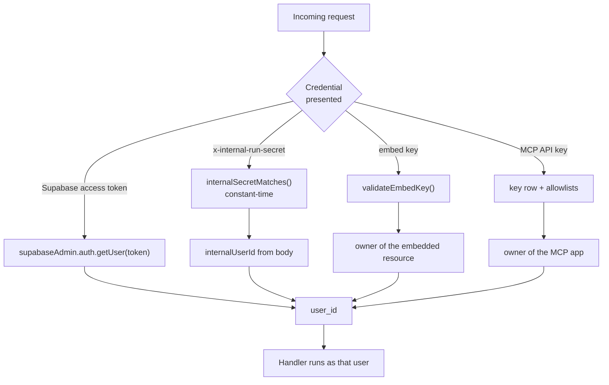
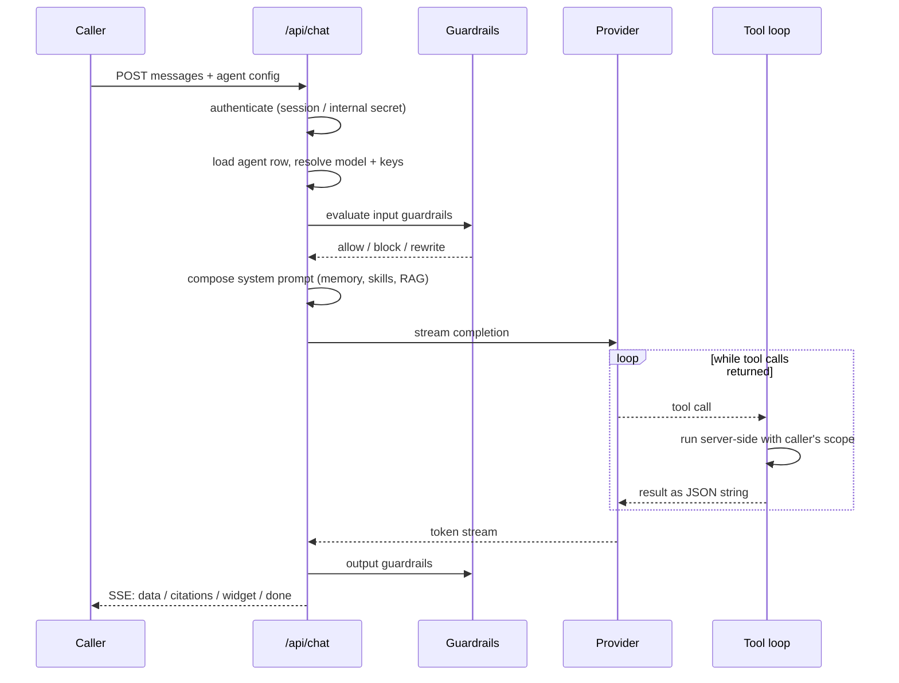

# 01 · Request lifecycle

> Part of [The engineering behind AgentSwarms](./README.md).

Everything else in this section assumes you know how a request gets in and how
it acquires an identity. This chapter is that, and nothing else.

---

## Two server surfaces, deliberately

AgentSwarms has two ways to run code on the server, and they are not
interchangeable.

**Server functions** (`createServerFn`) are typed RPC. You call them from a
component like a local async function; the framework handles serialisation.
Around 32 modules under `src/utils/` export them — `src/utils/iam.functions.ts`,
`src/utils/swarmDeploy.functions.ts` and their siblings, named `*.functions.ts`
by convention so a grep for the suffix finds the whole RPC surface.

**API routes** (`createFileRoute` under `src/routes/api/`) are ordinary HTTP.
They exist for the cases RPC cannot serve:

- **Streaming.** `/api/chat` returns Server-Sent Events over a held connection.
- **Foreign callers.** An embed on someone's marketing site, a hosted MCP server
  being called by Claude Desktop, a cron hitting `/api/bi/cron` — none of these
  are a React component with a session.
- **Self-calls.** Headless swarm execution POSTs to this app's own `/api/chat`.

The rule when adding something: if a signed-in user's browser is the only caller
and the response fits in memory, write a server function. Otherwise write a
route.

**File names map to URLs with dots as separators.** `mcp.s.$slug.ts` serves
`/api/mcp/s/<slug>`; `notebook.runtime.source.ts` serves
`/api/notebook/runtime/source`; `$` marks a path parameter. This trips people up
exactly once.

---

## How a caller becomes a `user_id`

Four mechanisms, in rough order of how much they are trusted.

### 1. A Supabase session token

The ordinary path. The client passes its access token explicitly — server
functions take it as an `access_token` argument rather than reading a cookie,
which keeps the dependency visible in the signature.

Validation is one call, `supabaseAdmin.auth.getUser(accessToken)`, and it is
worth being precise that this **verifies with Supabase** rather than decoding a
JWT locally. A revoked session fails here; a locally-verified signature would
not have noticed.

Role checks sit on top. `requireSuperadmin` in `src/utils/iam.server.ts` resolves
the token, then looks for a `superadmin` row in `user_roles`. The `ADMIN_EMAIL`
account is a permanent bootstrap grant that always passes and self-heals its own
row on first use, so a fresh instance is administrable before anyone has been
able to grant anything.

That bootstrap has a documented residual risk, stated in the source rather than
hidden: on a fresh deploy `allow_public_signup` defaults to true, so until the
operator claims `ADMIN_EMAIL` and switches to invite-only, the address is an
unclaimed _claim_ rather than a credential. Requiring a confirmed email closes it
when the Supabase project verifies addresses — and does **not** close it under
autoconfirm, where Supabase stamps `email_confirmed_at` for everyone and the
operator and an attacker present identical evidence. The fix is configuration,
which is why it is documented rather than patched.

### 2. The internal run secret

Headless paths — deployed swarm APIs, scheduled runs — execute LLM nodes by
calling this app's own `/api/chat` over HTTP. They authenticate with
`INTERNAL_RUN_SECRET` (falling back to the service-role key) and pass
`internalUserId` in the body to say whose run this is.

Two details matter more than they look.

**The comparison is constant-time.** `internalSecretMatches` in
`src/utils/internalOrigin.server.ts` compares lengths, then XORs every byte and
tests the accumulator once. A `===` would leak the secret a character at a time
to anyone who can measure.

**The origin is never derived from the request.** `new URL(request.url).origin`
reflects the client's `Host` header on most Node adapters. Since these self-calls
carry the internal secret in a header, a spoofed `Host:` would make the server
POST that secret to an attacker. The origin resolves only from configuration —
`PUBLIC_APP_URL`, then `SITE_URL`, then loopback — and never from user input.

### 3. An embed key

Public embeds authenticate with a key that identifies the embedded resource; the
`user_id` is the resource's owner, never the visitor.

The design principle is stated at the top of `src/routes/api/embed.chat.ts`: the
embed client sends **only** conversation messages plus the key. Every piece of
behavioural configuration — system prompt, provider, model, temperature,
knowledge bases, re-ranker, guardrails — loads server-side from the owner's rows
and cannot be overridden by the visitor. Workspace tools are hard-disabled;
retrieval over the wired knowledge bases is the single capability that survives.

This is the strictest surface in the app, because it is the only one where the
caller is anonymous and the bill belongs to someone else.

### 4. An MCP API key

Covered in [Sandboxes](./04-sandboxes.md#hosted-mcp-servers) and
[Security](./05-security-model.md#what-a-tool-allowlist-does-and-does-not-do).
Briefly: a key row carries a tool allowlist and an IP allowlist, and the proxy at
`src/routes/api/mcp.s.$slug.ts` checks both before a container is even started.

---

## Two database clients, one dangerous

There are two Supabase clients and knowing which you are holding is the whole
game.

| Client         | Where                                        | Sees                                      |
| -------------- | -------------------------------------------- | ----------------------------------------- |
| Browser client | `src/integrations/supabase/client.ts`        | Only what RLS lets the signed-in user see |
| Admin client   | `src/integrations/supabase/client.server.ts` | Everything, RLS bypassed                  |

`supabaseAdmin` holds the service-role key. Any handler using it has stepped
outside Row Level Security and is now personally responsible for scoping every
query by `user_id`. That is why the codebase reaches for it deliberately rather
than by default, and why the [security chapter](./05-security-model.md) spends
most of its length on what must never run in the same process.

The practical convention: when a route needs to act as the caller, it resolves
the token and filters explicitly. When it needs to act as the system — writing
an audit row the user must not be able to forge, reading a key row the user
cannot see — it uses the admin client and says why in a comment.

---

## What a request actually does

Taking `/api/chat` as the worked example, because it exercises every stage:

Every stage is a place a request can be refused, and each refusal has a distinct
shape on the wire so the client can tell a blocked prompt from a dead provider.
The protocol itself is documented in
[Agent runtime](./02-agent-runtime.md#the-sse-protocol).

---

## Where this bites you

**Adding a route that forgets the scope.** The admin client will happily return
another tenant's rows. There is no framework guard rail; the review question for
any new handler is "which client, and where is the `user_id` filter".

**Assuming `request.url` is trustworthy.** It reflects the `Host` header. If you
need this deployment's own address, use the helper in
`src/utils/internalOrigin.server.ts` — that is what it is for.

**Streaming from a server function.** It cannot; that is what routes are for. If
you find yourself buffering a stream to return it from RPC, you wanted a route.

---

Next: [02 · Agent runtime](./02-agent-runtime.md) — what happens between
authentication and the first token.
