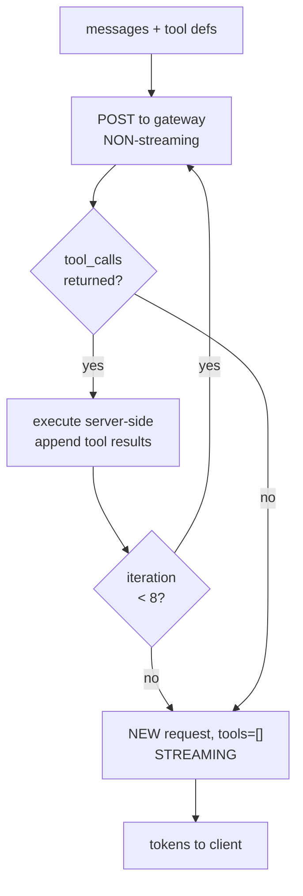

# 02 · Agent runtime

> Part of [The engineering behind AgentSwarms](./README.md).

`src/routes/api/chat.ts` is the busiest file in the application and the one
everything else calls. The swarm runtime calls it per agent node. Embeds call a
sibling that speaks the same protocol. Headless runs call it over HTTP from the
server itself. Getting its contract right mattered more than getting it small.

---

## Providers: one interface, ten adapters

Model providers disagree about nearly everything — auth, request shape, streaming
frame format, how usage is reported. `src/utils/providers/credentials.server.ts`
absorbs that behind `streamWithProvider`, with one adapter per family under
`src/utils/providers/adapters/`:

`anthropic` · `azure` · `bedrock` · `gemini` · `grok` · `oci` ·
`openai-compat` · `qwen` · `vertex` · `vllm`

`openai-compat` is the workhorse — OpenRouter, Groq, Together, Ollama and
anything else speaking the OpenAI chat-completions shape land there, which is why
"add a provider" is usually configuration rather than code. The named adapters
exist because those APIs genuinely differ: Bedrock and Vertex have their own
signing, Anthropic has its own event stream, Azure puts the deployment in the
path.

Credentials never travel to the client. They are stored encrypted
(`decryptJson`, `src/utils/providers/crypto.server.ts`), decrypted server-side at
call time, and the module carries a one-line warning at the top telling you not
to import it from client code. That is enforced socially rather than
mechanically, which is worth knowing before you add an import.

---

## The tool-calling loop

This is the part people get wrong when they reimplement it, so it is worth
explaining the shape rather than just pointing at
`src/utils/tools/loop.server.ts`.

Tool calling and streaming pull in opposite directions. You cannot know whether
the model wants a tool until it answers, and you cannot stream a final answer
that depends on tool results you have not fetched yet. The loop resolves this by
running in two phases:

**Phase one is non-streaming and synchronous.** Send messages plus tool
definitions, and if the model returns `tool_calls`, execute them, append the
results as `tool` role messages, and go round again. `MAX_ITERATIONS` is 8 — high
enough for a genuine multi-step research chain, low enough that a model stuck in
a loop costs bounded money.

**Phase two opens a fresh streaming request with `tools: []`.** Everything the
tools returned is already in the message history, so the model composes a normal
answer over it and the client gets an ordinary token stream. Passing `tools` here
would invite another tool call mid-stream, which is the bug this shape avoids.

Between iterations the loop emits `event: tool` frames so the playground
inspector can show what is happening live, rather than the UI sitting silent for
however long three tool round-trips take.

**Tool handlers all have the same signature** — `(ctx, args) => Promise<string>`
— and every one returns a JSON _string_, including on failure. Errors are caught
and returned as `{"error": "..."}` rather than thrown, because a thrown error
ends the turn while a returned one lets the model read what went wrong and try
something else. A model that gets `{"error":"Unknown skill \"foo\". Available:
..."}` usually recovers on the next iteration.

### What the model can call

`TOOLABLE_IDS` in `src/utils/tools/registry.server.ts` holds seventeen ids:

| Group        | Tools                                                                           |
| ------------ | ------------------------------------------------------------------------------- |
| Retrieval    | `kb_search`, `kb_graph_search`                                                  |
| Web          | `web_search`, `web_browse`                                                      |
| Data         | `sql_query`, `metric_query`                                                     |
| Integrations | `n8n_run_workflow`, `mcp_call_tool`, `send_notification`                        |
| Utility      | `calculator`, `datetime`, `weather`                                             |
| Memory       | `memory_remember`, `memory_recall`, `memory_forget`, `memory_set`, `memory_get` |

Every one runs **server-side with the caller's own scope**. The model never sees
a credential; it sees a tool name and gets back a string. `sql_query` runs
against the warehouse connection belonging to the user whose turn this is, not a
connection the model named.

---

## The SSE protocol

The wire format is OpenAI-compatible at its core, with named events layered on
top for everything OpenAI has no opinion about. Anything consuming a stream from
this app — the playground, the embed widget, the swarm runtime, the React SDK —
parses this:

| Frame                                             | Meaning                                                     |
| ------------------------------------------------- | ----------------------------------------------------------- |
| `data: {"choices":[{"delta":{"content":"..."}}]}` | A token. OpenAI-shaped on purpose, so existing clients work |
| `data: [DONE]`                                    | Stream complete                                             |
| `event: sources`                                  | Retrieval hits backing this answer                          |
| `event: citations`                                | Resolved citation markers                                   |
| `event: tool`                                     | A tool call started or finished, for the inspector          |
| `event: cost`                                     | Provider-reported spend for the turn                        |
| `event: memory_used`                              | Which memories entered the prompt                           |
| `event: guardrail_rewrite`                        | The input was modified before sending                       |
| `event: guardrail_warning`                        | The output tripped a check but was allowed                  |

Keeping the token frames OpenAI-shaped is the reason the embed path, which loads
entirely different configuration, can reuse the same client parser — the note at
the top of `src/routes/api/embed.chat.ts` calls this out explicitly.

`event: cost` deserves a footnote. It carries what the _provider_ reported, not
what a local price table guessed. That changed after a real incident: a model
that postdated the vendored catalog reported `$0.00` across 116 runs, and the
resolver was correctly answering that it had no price for it. Asking the provider
is the only answer that stays true as catalogs age.

---

## Guardrails

`src/utils/guardrails.ts` is shared by the server route and the swarm runtime, so
it is pure functions with no environment assumptions. It runs in two passes.

**Input**, before anything reaches a provider: a hard length cap, a
prompt-injection regex denylist, topic allow/denylists, tiered content-safety
keywords, and a PII policy that can detect, redact or block.

**Output**, on the assistant text: the PII policy again, profanity redaction,
content-safety flagging, a citation check for answers that should carry `[n]`
markers, and a hallucination filter that flags unsupported claims when the turn
was grounded.

The part worth respecting is what the module says about itself. It lists, in the
header comment, the settings that are **saved on the agent and read by nothing**
— `maxTurnsPerConversation` among them — under the heading `INERT`. A guardrails
module that quietly ignored half its configuration would be worse than one with
fewer options, because the operator would believe they had a control they did
not. If you add enforcement for one of those, move it out of that list in the
same commit.

---

## Composing the system prompt

The prompt the model sees is assembled per turn from four sources, and the
assembly order is a design decision rather than an accident.

1. **The agent's own system prompt**, as authored.
2. **Memory context** — resolved by `src/utils/memory/`, with an
   `event: memory_used` frame so the user can see what was recalled.
3. **Skills** — either inline or as an index; see below.
4. **Retrieved context** — RAG hits, when knowledge bases are wired.

### Skills, and why they are sometimes an index

Attached skills used to be pasted into the prompt in full on every turn. That is
correct and cheap for two short skills and wasteful for a dozen long ones: the
agent pays for all of them on every turn even when it uses none.

`src/lib/skills.ts` now measures the combined size and picks a mode.
`SKILLS_INLINE_MAX_CHARS` (default 8000, `SKILLS_INLINE_MAX_CHARS_DEFAULT`) is
the threshold. Below it nothing changed — bodies go inline exactly as before.
Above it the prompt carries only names and one-line summaries, and the agent
fetches a body through a `use_skill` tool registered for that turn.

The default was chosen so all six bundled sample skills stay inline, and a test
pins that, so the default cannot drift out from under them without a red build.

Swarms are unaffected: the headless executor sends no skill ids, and canvas nodes
carry narrow skill sets that sit well under the threshold.

---

## Where this bites you

**Adding a tool means adding a capability, not a function.** The registry gates
on whether the underlying capability exists — a `sql_query` with no warehouse
connection should not be offered to the model at all. Registering the definition
without the gate produces a tool that always fails.

**`MAX_ITERATIONS` is a cost ceiling, not a correctness one.** Raising it makes
runaway loops more expensive before they stop. If a workflow genuinely needs more
than eight tool round-trips, it probably wants to be a swarm.

**The two-phase loop means tool results are in history twice** — once as the
`tool` message, once implicitly in whatever the model wrote about them. Long tool
outputs are the usual reason a turn blows its context window.

---

Next: [03 · Swarm runtime](./03-swarm-runtime.md) — what happens when one agent
is not enough.
