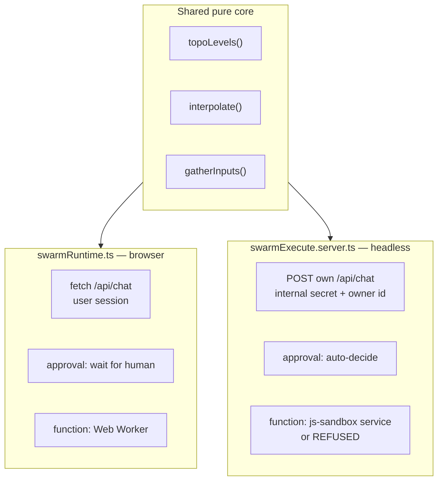

# 03 · Swarm runtime

> Part of [The engineering behind AgentSwarms](./README.md).

A swarm is a directed graph of nodes that pass values along edges. The canvas is
XYFlow; the execution model is deliberately boring — topologically sort, run
each level, write each node's result into a shared map under its `outputVar`,
interpolate that map into the next node's inputs.

The interesting part is that there are **two** executors, and understanding why
explains most of the constraints in this chapter.

---

## Why two executors

`src/lib/swarmRuntime.ts` runs in the browser. It streams `/api/chat` per agent
node, updates the canvas live, and pauses on approval nodes until a human clicks.
Its header carries a warning worth repeating: _keep this client-only_. It uses
`fetch()` and the browser Supabase client, so the user's own session scopes
everything it touches.

`src/utils/swarmExecute.server.ts` runs on the server, because the browser
runtime cannot run without a tab. Deployed swarm APIs and scheduled runs have no
tab, so they use this one.

Two implementations of the same semantics is normally a bug waiting to happen.
The mitigation is that the **pure graph logic is shared** — `topoLevels`,
`interpolate`, `gatherInputs`, `resolveStatePath`, `hasDoneSignal` are imported
by both. What differs is only the IO: how an LLM node is called, how a value is
persisted, what happens at an approval.

If you change graph semantics, change them in the shared helpers. A fix applied
to one executor and not the other is the failure mode this layout is trying to
make obvious.

---

## Node kinds

Eighteen, grouped by what they do rather than by the order they appear in the
palette.

| Group        | Nodes                                | Notes                                                                                                                          |
| ------------ | ------------------------------------ | ------------------------------------------------------------------------------------------------------------------------------ |
| Boundary     | `input`, `output`                    | Seed value and terminal result                                                                                                 |
| Model        | `agent`, `condition`, `evaluate`     | `condition` is an LLM-judged boolean that picks an outgoing edge by label; `evaluate` is LLM-as-judge scoring against a rubric |
| Control flow | `router`, `loop`, `foreach`, `merge` | `loop` re-runs its body until a check passes or `max_iters`                                                                    |
| Data         | `extract`, `set_var`, `retrieve`     |                                                                                                                                |
| External     | `http`, `tool`                       | `tool` covers MCP and integration calls; `http` goes through the SSRF guard                                                    |
| Code         | `function`                           | User-authored JavaScript — see below                                                                                           |
| Composition  | `subswarm`                           | A swarm as a node inside another                                                                                               |
| Human        | `approval`                           | Blocks on a human decision                                                                                                     |
| Federation   | `a2a_remote`                         | Calls another agent over A2A                                                                                                   |

Two of these behave differently depending on which executor is running, and both
differences are security decisions rather than conveniences.

---

## `function` nodes: sandboxed or refused

User-authored JavaScript is the sharpest edge in the product, because swarms are
**shareable**. Importing a stranger's `.swarm.json` and pressing Run means
executing their code.

On the canvas it runs in a Web Worker (`src/lib/sandbox/jsSandbox.ts`). Headless,
it runs in a separate hardened container (`services/js-sandbox/`).

`JS_SANDBOX_URL` configures that address, and it is optional — not because there
is a fallback, but because `src/utils/jsSandbox.server.ts` probes two defaults
when it is unset: `http://js-sandbox:8091` (the Compose service name) then
`http://127.0.0.1:8091` (the published port, for an app running on the host under
`npm run dev`), with the result cached for 60 seconds. That discovery exists so
"no address to configure" is true rather than merely claimed — a documentation
fact-check caught that sentence being false before the fallback existed.

When nothing answers, the executor **refuses the node** with a message saying how
to enable it, "rather than pretending the node ran". It does not fall back to
running the code in the app process. That process holds the service-role key,
every decrypted provider credential and the database connection, so a convenient
fallback there would hand a stranger's snippet the keys to the instance.

The two sandboxes are pinned to one contract by
`tests/unit/sandboxParity.test.ts`, so a component behaves identically wherever
it runs. [Sandboxes](./04-sandboxes.md) covers what each one actually blocks.

---

## Owner scoping on headless runs

This is the subtlest thing in the file and the easiest to get wrong if you extend
it.

A headless run has no user session. The executor therefore runs tool loaders
under the **service-role client** — which bypasses RLS entirely — but sets
`ctx.scopeUserId` to the swarm owner. Every loader filters on that, restricting
results to what the owner could read anyway: their own tables and knowledge
bases, public samples, and IAM-shared resources. It mirrors RLS in application
code because RLS is not available on that connection.

Agent nodes get a second restriction. When `/api/chat` is called on its internal
path it caps the toolset to the headless-safe set and owner-scopes it, so an
agent inside a scheduled swarm cannot reach further than the same swarm run
manually would.

`a2a_remote` is the one node that stays owner-login-only, because it needs the
owner's JWT to authenticate through the `/api/a2a` proxy — there is no
service-secret equivalent for a credential that belongs to a person.

**The invariant:** a headless run must never be able to read or do more than the
owner running it interactively. If you add a loader, it takes `scopeUserId` and
filters on it, or it does not ship.

---

## Approvals, headless

An `approval` node blocks on a human in the browser. There is no human in a
scheduled run at 3am, so headless runs **auto-decide** them.

That is a deliberate trade and worth understanding before you design a swarm
around it: an approval gate you rely on for safety is not a gate on the scheduled
path. If the decision genuinely requires a person, the swarm should not be
scheduled.

---

## Where this bites you

**Adding a node kind means touching both executors.** The pure core will not
save you here — the IO differs by design. Grep for the node id in both files.

**`context` is keyed by `outputVar`, not by node id.** Two nodes writing the same
`outputVar` overwrite each other silently. This is a feature for `merge`-style
patterns and a bug everywhere else.

**Client-only means client-only.** `swarmRuntime.ts` importing anything
server-side breaks the build in a way that is not obvious from the error. The
header comment is load-bearing.

---

Next: [04 · Sandboxes](./04-sandboxes.md) — three isolation designs, three
threat models.
