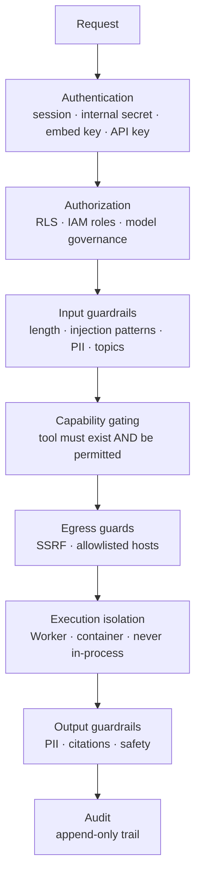

# 05 · Security model

> Part of [The engineering behind AgentSwarms](./README.md).

One sentence carries most of this chapter: **the app process holds the
service-role key.** It can read and write every row belonging to every user, RLS
bypassed. Every guard below exists because something untrusted might otherwise
reach that process, or borrow its authority.

The second sentence: **anything arriving from outside is data, never
instruction.** A swarm arrives as JSON from a stranger. A tool result is
attacker-controllable text. A model can be talked into anything. None of those
may become an executed decision without passing a guard written for that case.

---

## Defence in depth, concretely

No single layer is trusted to be sufficient. RLS is the authority even though the
app also filters; the SSRF guard resolves addresses even though the URL was
validated; the sandbox holds no secrets even though callers are authenticated.

---

## Row Level Security is the authority

Access control lives in Postgres policies, across 173 migrations in
`supabase/migrations/`. The application's own checks are a second layer, not the
first — a bug in a handler should fail closed at the database rather than leak
rows.

This has one consequence that must be respected everywhere: **the moment you
reach for `supabaseAdmin`, RLS is gone and you own the scoping.** The convention
is to use it only where the system must act as itself rather than as the caller —
writing an audit row a user must not be able to forge, reading a key row a user
cannot see — and to say why in a comment.

The [headless swarm executor](./03-swarm-runtime.md#owner-scoping-on-headless-runs)
is the hardest case: it has no session, so it runs under the service-role client
with `ctx.scopeUserId` set, and every loader filters on that to mirror what RLS
would have allowed. The invariant is that a scheduled run can never read more
than the owner running it by hand.

---

## SSRF: the guard with two tiers

`src/utils/ssrfGuard.server.ts` protects every server-side fetch of a URL that a
user _or a model_ supplied. The swarm `http` node takes a URL the user authored;
`web_browse` takes one the **model** chose, reachable by prompt injection,
including through a public embed. All of them run inside the deployment's
network.

The policy is deliberately two-tier, and the reasoning is worth reproducing
because most SSRF guards get this wrong in one direction or the other:

**Always refused, unconditionally.** Link-local, cloud-metadata, unspecified and
multicast addresses. `169.254.169.254` — the AWS/GCP/Azure/OCI instance metadata
endpoint — can hand out the host's IAM credentials and has no legitimate use as a
fetch target, so nothing can enable it.

**Allowed by default.** Ordinary private networks: localhost, RFC1918, CGNAT,
IPv6 ULA. This is a self-hostable product, and self-hosted model servers
(Ollama, vLLM), in-cluster MCP servers and self-hosted n8n all live there.
Refusing them by default would break the primary use case to defend against a
threat most operators do not have. Those who do — untrusted multi-tenant, public
embeds — set `BLOCK_PRIVATE_NETWORK_FETCH=true`.

Two implementation details do the actual work: **the hostname is resolved and
every resulting IP is checked**, not just the literal in the URL; and
**redirects are followed manually**, so a public URL cannot `302` into a blocked
range.

**Residual risk, documented rather than hidden:** DNS rebinding. The guard
validates the resolved address and then calls `fetch()`, which resolves again.
Closing that properly needs connection-level pinning.

---

## Prompt injection, and where the line is

The honest position is that prompt injection is not solved here or anywhere. What
the design does is make a successful injection _unable to do much_:

- **The model never holds a credential.** Tools run server-side under the
  caller's scope. Convincing the model to "use the admin key" fails because there
  is no key in its context to use.
- **Tool availability is gated on capability.** A `sql_query` tool is not offered
  when no warehouse connection exists, so it cannot be argued into existence.
- **URLs the model chooses go through the SSRF guard**, which is why
  `web_browse` cannot be talked into reading cloud metadata.
- **Embeds hard-disable workspace tools.** The anonymous surface has the smallest
  reachable capability set in the product.
- **Input guardrails carry a pattern denylist** (`src/utils/guardrails.ts`) —
  useful, and explicitly not a boundary.

### What a tool allowlist does and does not do

An API key for a hosted MCP server carries a `tool_allowlist`. It is worth being
exact about its scope, because it is easy to over-read.

The check in `src/routes/api/mcp.s.$slug.ts` is a **name** check — the requested
tool must be in the list. It does not inspect arguments. Once `run_query` is
approved for a key, that key may call `run_query` with any argument the tool's
own schema accepts.

The **tool fingerprint** is a separate control for a separate attack. Tool names,
descriptions and schemas are instructions the calling model reads, so a server
that quietly changes them after being trusted is the "rug pull" MCP's security
guidance calls out. A redeploy that moves the fingerprint parks the server until
a human approves the diff.

Neither is argument-level policy. Between those two and dispatch sit: the IP and
origin allowlists, a JSON-RPC method forward list, per-key rate limiting and
per-server concurrency, a body-size cap, and then FastMCP/pydantic validating
argument _types_ against the declared schema. Past that the model is containment
rather than prevention — own container, secrets only in that process, default-deny
egress.

---

## Credentials

Provider credentials are stored encrypted and decrypted server-side at call time
(`src/utils/providers/crypto.server.ts`). They never reach the client, and
`src/utils/providers/credentials.server.ts` carries a one-line warning against
importing it from client code — enforced by convention, so read it before you add
an import.

The internal shared secret used for server→own-API calls is compared in constant
time, and the origin those calls target is resolved **only from configuration**,
never from `request.url`, because that reflects the client's `Host` header. A
spoofed `Host:` would otherwise make the server POST its own secret to an
attacker. See [Request lifecycle](./01-request-lifecycle.md#2-the-internal-run-secret).

`.gitignore` covers `.env` backups — `.env.cloud.bak`, `.env.production.backup`,
`.env.old.copy` — because those hold the same service-role and provider keys as
`.env` itself and sat one `git add -A` from being committed.

---

## Generated code is an injection surface

The agent and swarm exporters turn a saved graph into a Python or TypeScript file
the user is told to run. A swarm can arrive from anyone as a dropped
`.swarm.json` that is one click from the export menu, which makes **every**
interpolated value untrusted.

Three classes were closed there, and they generalise to any code generator:

1. **Numeric fields are coerced, not pasted.** A `temperature` interpolated bare
   is an expression slot.
2. **Labels are sanitised before reaching docstrings**, where a crafted string
   can close the comment and continue as code.
3. **Tool configs are redacted**, not serialised — an export used to carry a
   plaintext `api_key`.

---

## Auditing

The audit log's whole purpose is evidence, which makes it the worst possible
place for a failed read to render as an empty state. It was: a discarded error
produced a page that manufactured evidence of absence. Both findings there were
fixed with the injection positively confirmed rather than assumed — see
`docs/ADVERSARIAL_LOG.md`, which records where the audit looked as carefully as
what it found.

---

## Known weak points

Stated because an unstated limit is worse than a known one:

- **DNS rebinding** against the SSRF guard, above.
- **The `ADMIN_EMAIL` bootstrap under autoconfirm.** With email confirmations
  disabled, Supabase stamps `email_confirmed_at` for everyone, so the operator
  and an attacker present identical evidence — possession of a string. The fix is
  configuration; see [Request lifecycle](./01-request-lifecycle.md#1-a-supabase-session-token).
- **Egress filtering is instance-wide**, not per-sandbox.
- **No argument-level policy** in front of MCP dispatch, as above.
- **Approval nodes auto-decide on headless runs**, so an approval gate is not a
  safety gate on the scheduled path.

---

Next: [06 · Scale and concurrency](./06-scale-and-concurrency.md).
