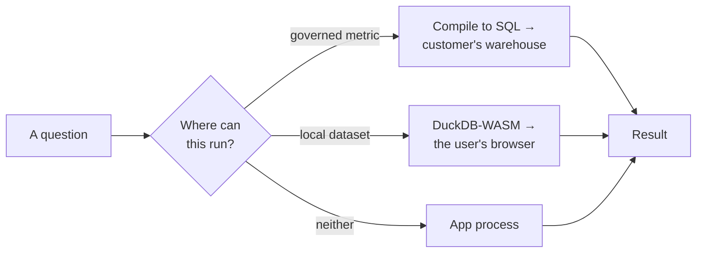

# 06 · Scale and concurrency

> Part of [The engineering behind AgentSwarms](./README.md).

[Scale and limits](../SCALE_AND_LIMITS.md) is the exhaustive table of every row
cap, timeout and ceiling. This chapter is the engineering behind them: where work
actually executes, why the rate limiter exists in two flavours, and what breaks
first.

---

## The app is a coordinator, not an engine

The single most important scaling decision is that **AgentSwarms tries not to be
where the data is**.

A semantic query compiles to SQL and runs in the warehouse, which is already
sized for it. A local dataset runs in DuckDB-WASM in the browser, which means the
user's own machine pays for it and no server memory is involved. Only
orchestration — assembling prompts, calling providers, moving results — happens
in the app.

That is why a single container is a reasonable default, and it is also the
honest boundary of the product: **there is no distributed in-memory engine.**
Warehouse tables of any size are fine; importing a billion rows into a _local_
dataset is not. The warehouse is the engine.

The local engine has its own ceilings, all tunable and all defaulted
conservatively because they run on someone's laptop:
`LOCAL_ENGINE_MEMORY_MB` (512), `LOCAL_ENGINE_THREADS` (2),
`LOCAL_ENGINE_TIMEOUT_MS` (30000).

---

## Two rate limiters, and the bug that produced them

`src/utils/rateLimit.server.ts` has functions in two flavours, and picking the
wrong one is a real defect rather than a style choice.

**In-memory** (no suffix) keeps its counter in the process. Behind a load
balancer with N instances, the effective ceiling is **N × the configured limit**.
That is fine for cheap, high-frequency endpoints where the limit exists only to
stop a runaway client, and it costs no round trip.

**Global** (`rateLimitedGlobal`) counts in Postgres, so every instance shares one
counter and the configured number is the number the operator actually gets.

The distinction was learned rather than designed. The module says it plainly: the
documented per-key ceilings on swarm runs "silently became 4x their configured
value on a four-instance deployment". A limit that is a _guard_ can tolerate
that. A limit that is a **governance claim** — a number written in the docs that
a customer relies on — cannot.

The rule: if the number is published, use the global variant. It costs one round
trip, so it is for expensive operations, not per-keystroke endpoints.

Where the global limiter is used today, and what each protects:

| Endpoint               | Bucket        | Default                             |
| ---------------------- | ------------- | ----------------------------------- |
| `/api/swarm/run`       | per key       | `SWARM_RUN_RATE_LIMIT_PER_MIN` (30) |
| `/api/mcp/s/<slug>`    | per API key   | `MCP_RATE_LIMIT_PER_MIN` (120)      |
| `/api/data/upload`     | per user      | `UPLOAD_PER_MINUTE` (10)            |
| `/api/embed/chat`      | per embed key | 30                                  |
| `/api/embed/analyst`   | per embed key | 5                                   |
| `/api/bi/direct-query` | per caller    | configured                          |

The embed numbers are the tightest in the product, which follows from embeds
being the only anonymous surface where someone else pays the bill.

---

## Concurrency is capped per resource, not globally

Rate limiting bounds requests per minute; concurrency bounds how many are in
flight. They fail differently, so they are configured separately.

| Cap                             | Default    | Protects                                    |
| ------------------------------- | ---------- | ------------------------------------------- |
| `SWARM_LEVEL_CONCURRENCY`       | 4          | Nodes run in parallel per graph level       |
| `SWARM_RUN_MAX_CONCURRENT`      | configured | Simultaneous swarm runs                     |
| `MCP_MAX_CONCURRENT_PER_SERVER` | 8          | In-flight calls to one published MCP server |
| `JS_SANDBOX_MAX_CONCURRENT`     | 4          | Simultaneous sandbox executions             |

`MCP_MAX_CONCURRENT_PER_SERVER` is per **app**, while the rate limit is per
**key**, and the comment explains why the two differ: one noisy key must not be
able to pin every worker on a server that other keys also use.

Swarm runs also carry `SWARM_RUN_TIMEOUT_MS`, because a synchronous call holds
the connection until the swarm finishes — which is the fact that decides
sync-versus-async for anyone integrating.

---

## Scale-to-zero, and what it costs

Hosted MCP servers and notebook kernels do not exist until someone calls them.
The first call pays the start; the reaper removes idle containers.

This is the right default for a self-hosted product where most servers are idle
most of the time, and it has a real cost: `COLD_START_MS` is 90 seconds. The
budget is measured, not guessed — container up at ~3s, session ready at ~23s on
an idle machine with the image pulled, with the app's `pip install` inside that
window. A previous 45s budget left barely one healthy start of headroom, and
anything that ate it pushed a working server over the line.

The failure path mattered as much as the budget: it used to destroy the container
it had given up on, so the next attempt paid the full cold start again instead of
finding it seconds from ready.

A per-server **Keep warm** option holds the container permanently, for
latency-sensitive servers. The trade is explicit — memory and CPU scale with the
number of _distinct warm servers_, not with request volume.

---

## Capped views must say they are capped

A scaling decision that shows up as a correctness property: several surfaces read
a bounded page of a larger table. Every one of them now discloses it.

The analytics page reported a thousand traces as though they were the population.
The trace log presented its page as the whole. The AI Analyst has a 50-row
display cap that could be hit silently — aggregates run in the database and the
cap only trims what is _displayed_, but a number without that disclosure is a
number a reader will over-trust.

The rule this settled on: **a cap that a reader could mistake for the whole
population is a disclosure obligation, not just a limit.**

---

## What breaks first

In rough order, on a single-container deployment:

1. **Provider rate limits**, long before anything in this app. Most "AgentSwarms
   is slow" reports are a provider queueing.
2. **Warm MCP servers and notebook kernels**, if several are kept warm. Each is a
   container; see [System requirements](../SYSTEM_REQUIREMENTS.md).
3. **Local dataset size.** DuckDB-WASM runs in the browser, so this fails on the
   user's machine, not the server — which makes it look like a client bug.
4. **The app process**, last, because it is mostly waiting on other people's
   networks.

Scaling horizontally is the supported answer for 4, with the caveat that started
this chapter: in-memory rate limits multiply by instance count, so anything you
publish as a ceiling needs the global limiter.

---

Next: [07 · Conventions](./07-conventions.md).
