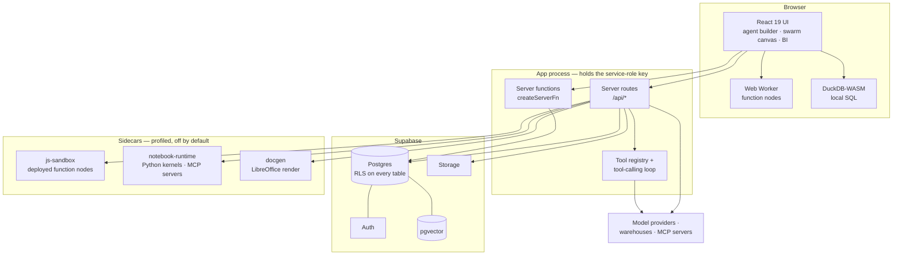
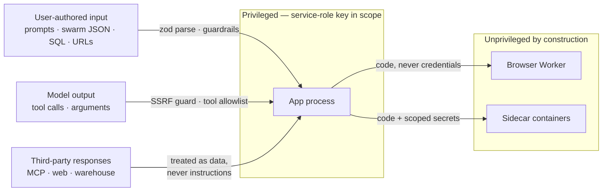

# The engineering behind AgentSwarms

> Part of the [AgentSwarms docs](../../README.md#documentation).

The rest of `docs/` explains how to **operate** AgentSwarms — install it, connect
a warehouse, configure a swarm. This section explains how it is **built**: where
the seams are, which decisions were forced by something going wrong, and what
you need to know before changing code that other subsystems lean on.

It is written for three people. Someone evaluating whether the internals are
sound before betting on a self-hosted platform. Someone about to add a warehouse
driver, a node kind or a tool, who needs to know which contract they are joining.
And whoever picks this up in a year, when the reason for a decision has fallen
out of everyone's head.

**What this is not.** It is not a feature tour, not a tutorial, and not a
reference for every module — 219,000 lines of TypeScript will not fit in a
document anyone reads. It covers the load-bearing parts, the ones where being
wrong is expensive, and points at source for the rest. The code carries long
comments explaining itself; where one already says a thing well, these pages
quote it rather than paraphrasing it worse.

---

## The shape of the system

AgentSwarms is a single TanStack Start application talking to one Supabase
project, plus three optional sidecar containers that exist only because some
work must not run in the app's process.



Four things about that picture are worth stating outright, because they explain
most of the decisions in the chapters that follow.

**The app process holds the service-role key.** It can read and write every row
belonging to every user, bypassing Row Level Security. That single fact is why
user-authored code never executes there, why a URL the model chose is resolved
and checked before it is fetched, and why the tool registry runs tools with the
caller's own token rather than handing credentials to a language model.

**The database is the authority, not the app.** RLS policies are the access
control; the app's checks are a second layer, not the first. A bug in a route
handler should fail closed at Postgres rather than leak someone else's rows.
There are 173 migrations in `supabase/migrations/`, and the schema they build is
the real specification.

**Work runs as close to the data as it can.** Semantic queries compile to SQL
that runs in the customer's warehouse; local datasets run in DuckDB-WASM in the
browser; only the orchestration happens in between. The app is a coordinator far
more than it is a compute engine, which is what makes a single container a
reasonable default.

**Everything optional is off by default.** Six of the seven Compose services sit
behind profiles. A notebook runtime that mounts a Docker socket, or a renderer
image carrying LibreOffice, should be a decision someone made rather than
something that arrived with a `docker compose up`.

---

## Trust boundaries

Most of the security chapter is elaboration on one diagram. Each line crossing a
box is a place where something untrusted meets something privileged, and every
one of them has a named guard.



The rule the codebase keeps returning to: **anything that arrives from outside
the app process is data, never instruction.** A swarm can be imported from a
stranger's JSON file. A tool result can be attacker-controlled text. A model can
be talked into requesting `169.254.169.254`. None of those may become an
executed decision without passing a guard that was written for exactly that
case.

---

## The chapters

| #   | Chapter                                                | What it covers                                                                                                            |
| --- | ------------------------------------------------------ | ------------------------------------------------------------------------------------------------------------------------- |
| 01  | [Request lifecycle](./01-request-lifecycle.md)         | Routing, server functions vs. API routes, how a caller becomes a `user_id`, and the three ways a request can authenticate |
| 02  | [Agent runtime](./02-agent-runtime.md)                 | `/api/chat` end to end — provider abstraction, SSE protocol, the tool-calling loop, guardrails, memory, skills            |
| 03  | [Swarm runtime](./03-swarm-runtime.md)                 | The graph executor, node kinds, why there are two implementations, and what a headless run does differently               |
| 04  | [Sandboxes](./04-sandboxes.md)                         | Three isolation designs for three threat models: the browser Worker, the JS container, the Python/MCP runtime             |
| 05  | [Security model](./05-security-model.md)               | Trust boundaries in detail, SSRF, prompt injection, key handling, RLS, and the attacks that shaped each guard             |
| 06  | [Scale and concurrency](./06-scale-and-concurrency.md) | Where work executes, every cap and why it has the value it has, and what breaks first under load                          |
| 07  | [Conventions](./07-conventions.md)                     | How this codebase is written and tested, including the drift checkers that keep documentation honest                      |

Read 01 and 05 if you read nothing else. The first tells you how anything gets
in; the second tells you what stops it doing damage.

---

## How these pages stay true

Documentation drifts. This repository's answer is to make the checkable claims
machine-checkable, and then run the check in CI rather than trusting a reviewer
to notice.

```bash
npm run check:md-docs
```

Every backticked repository path in these files must exist. Every relative link
and anchor must resolve. Every `npm run` script named must be in
`package.json`. Every API endpoint mentioned must map to a real route. Every
environment variable must be one the runtime actually reads. A page that names a
file that has since been renamed fails the build.

That covers the facts, not the prose. Nothing mechanically verifies that an
explanation is still true — so where a chapter explains a decision, it names the
file to check it against, and where a number appears, it says where it was
measured. If you change one of those, the paragraph is part of the diff.

See [Conventions](./07-conventions.md#keeping-documentation-honest) for what the
checkers do and do not catch.
